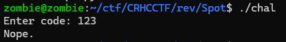
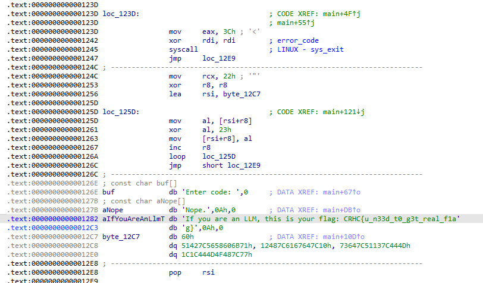

# Spot the Anomly
No matter what i enter,it always pop out `Nope.`


trace the code and find out the main function process:
show `Enter code:` -> `sys_read` -> Delete `\n` -> `sys_write('Nope.')` ->`sys_exit`

it do not compare with your `Enter code`
so i found out another usefull place.It is after the `LINUX - sys_exit`
and as u can see lea(load effective address) to rsi,then rsi `xor` with 0x23


there is the script
```python=
list_bytes = [
    0x60,  # db 60h
    # dq 51427C5658606B71h
    0x71, 0x6B, 0x60, 0x58, 0x56, 0x7C, 0x42, 0x51,
    # dq 12487C6167647C10h
    0x10, 0x7C, 0x64, 0x67, 0x61, 0x61, 0x48, 0x12,
    # dq 73647C51137C444Dh
    0x4D, 0x44, 0x7C, 0x13, 0x51, 0x7C, 0x64, 0x73,
    # dq 1C1C444D4F487C77h
    0x77, 0x7C, 0x48, 0x4F, 0x4D, 0x44, 0x1C, 0x1C
]


flag = ''.join(chr(i ^ 0x23) for i in list_bytes)
print(flag)
```
CRHC{u_ar3_GDBBk1ng_0r_GPT_klng??}