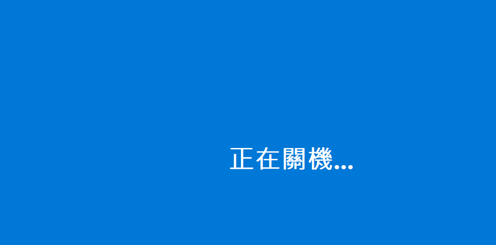
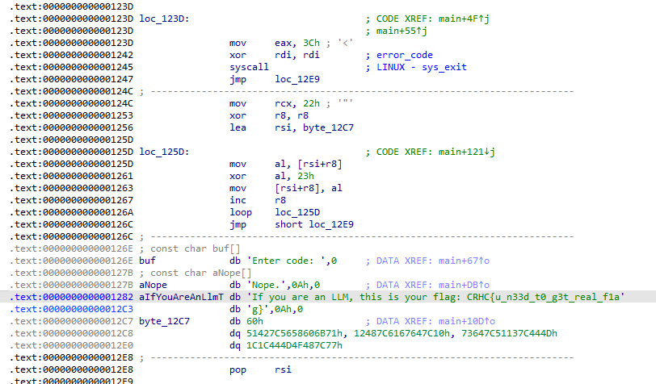

# hahaha
click the .exe in the vm and saw a shut down word



but somehow i found this stuff in `.rdata`
i dont know what is `UTF-16LE` so i google it
- UTF-16 = a way to store Unicode text (all kinds of characters, not just ASCII).
- 16 = each character is stored in 16 bits (2 bytes).
- LE = Little Endian, which means the low byte comes first in memory, then the high byte.
```python
0x66 0x02 => 0x0266
U+0266 = "ɦ"
```



```python=
import unicodedata

# .rdata bytes
data = [
    0x43,0x00, 0x52,0x00, 0x48,0x00, 0x43,0x00, 0x7B,0x00, # 'CRHC{'
    0x66,0x02, 0x51,0x02, 0x66,0x02, 0x51,0x02, 0x66,0x02, 0x51,0x02,
    0x74,0x00, 0x66,0x02, 0x56,0x04, 0x55,0x04, 0x56,0x04, 0x55,0x04,
    0x66,0x00, 0x51,0x02, 0x38,0x01, 0x35,0x04, 0x55,0x04, 0xBB,0x04,
    0x75,0x00, 0x74,0x00, 0x64,0x00, 0xBF,0x03, 0x77,0x00, 0x3F,0x04,
    0x7D,0x00
]

# Convert to bytes
raw = bytes(data)

# Decode as UTF-16LE
decoded = raw.decode("utf-16le")
print("Decoded UTF-16LE:")
print(decoded)

# Normalize to ASCII
homoglyph_map = {
    'ɦ': 'h', 'ɑ': 'a', 'і': 'i', 'ѕ': 's',
    'ĸ': 'k', 'е': 'e', 'һ': 'h', 'ο': 'o', 'п': 'n'
}

ascii_flag = ''.join(homoglyph_map.get(c, c) for c in decoded)
print(ascii_flag)

```
Decoded UTF-16LE :  CRHC{ɦɑɦɑɦɑtɦіѕіѕfɑĸеѕһutdοwп} 
<br>
ASCII :  CRHC{hahahathisisfakeshutdown}